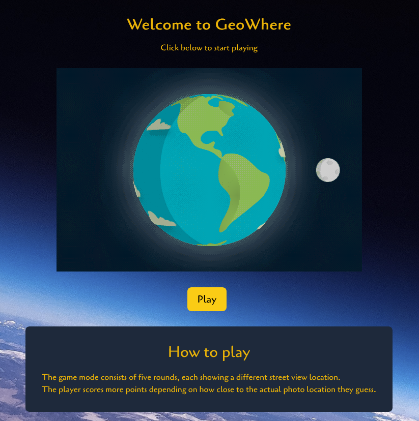
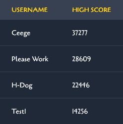

# GeoGuesser

### How to Play
Press the play button and you are transported into Google Maps streetview. From here you have 5 rounds to try and guess where you are in the world, you are given a Guessmap to the right hand side where you place a marker and press the Guess button. Then your location will be calculated from the distance from the correct location of the site and you will gain a score based on that calculation. You will continue this for 5 rounds and will get a final score. This will go into our database (if you are logged in) and you can then see how you fared against other people who have also played. Good Luck!

### Click Here To Play:
[Geoguessr](https://geowhere.netlify.app/)

### Tech Stack:
- React
- Supabase
- Tailwind 
- React google API
- Netlify
- Google Maps API

### Screenshots:

    

    
    

### Next Steps
- Add new game modes for Landmarks around the world
- Fix the quiz
- Allow multiplayer games to happen